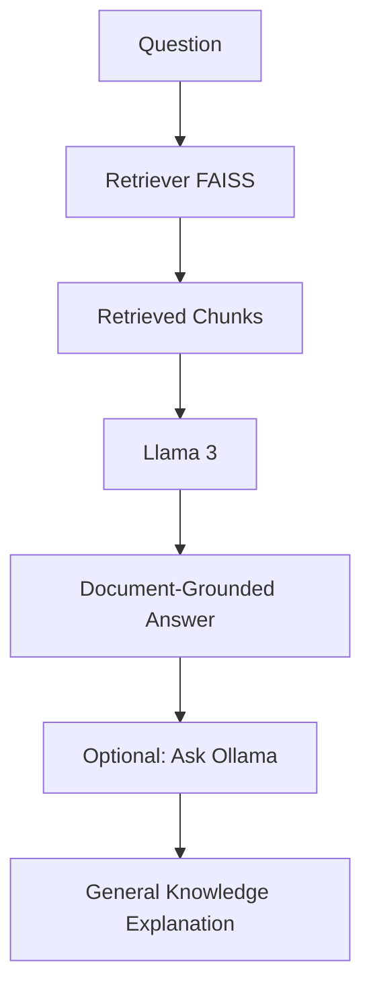

# DocQ AI

## Description
A Retrieval-Augmented Generation (RAG) document question answering system that allows users to upload documents, perform semantic search using FAISS, answer questions using retrieved context, and optionally ask Ollama for broader AI explanations.

## Features
* Upload PDF, DOCX, and TXT files
* Semantic document chunking
* SentenceTransformer embeddings
* Persistent FAISS vector index
* Context-grounded question answering
* Source citations
* Context viewer with relevancy scores
* Optional Ask Ollama workflow
* Dark and light themes
* Responsive UI

## Architecture

```
       Question
          ↓
   Retriever (FAISS)
          ↓
   Retrieved Chunks
          ↓
       Llama 3
          ↓
Document-Grounded Answer
          ↓
      (Optional)
      Ask Ollama
          ↓
General Knowledge Explanation
```



## Tech Stack

**Frontend:**
* Next.js
* TypeScript
* Tailwind CSS
* shadcn/ui
* Lucide React

**Backend:**
* FastAPI
* SentenceTransformers
* FAISS
* Ollama
* Llama 3
* PyMuPDF
* python-docx

## Project Structure
```
backend/
├── app/
│   ├── ingestion/       # Document loaders, chunkers, and embedders
│   ├── models/          # Embedding model loader
│   ├── rag/             # RAG pipeline and response generator
│   ├── utils/           # Shared utility modules
│   ├── vectorstore/     # FAISS vector index manager
│   ├── config.py        # Settings and configurations
│   ├── main.py          # FastAPI application routes
│   └── schemas.py       # Pydantic validation schemas
└── requirements.txt     # Python dependencies

frontend/
├── app/                 # Next.js pages and layouts
├── components/          # React components
├── lib/                 # Constants, helpers, and API client
├── store/               # State management store
├── tailwind.config.ts   # Styling configuration
└── package.json         # Node.js dependencies

data/
├── uploads/             # Uploaded PDF, DOCX, and TXT files
└── index/               # Persistent FAISS index and metadata
```

## Installation

### Prerequisites
* Python 3.10 or higher
* Node.js 18 or higher
* [Ollama](https://ollama.com) installed and running locally

### 1. Clone the Repository
```bash
git clone https://github.com/your-username/rag-document-qa.git
cd rag-document-qa
```

### 2. Configure Backend
Set up a Python virtual environment and install the required dependencies:
```bash
cd backend
python -m venv venv

# Activate virtual environment
# On Windows (PowerShell):
.\venv\Scripts\Activate.ps1
# On Windows (Command Prompt):
.\venv\Scripts\activate.bat
# On macOS/Linux:
source venv/bin/activate

# Install dependencies
pip install -r requirements.txt
```

### 3. Setup Ollama
Ensure Ollama is running and pull the Llama 3 model:
```bash
ollama pull llama3
```

### 4. Configure Frontend
Install the required packages using pnpm or npm:
```bash
cd ../frontend
pnpm install
# or
npm install
```

### 5. Running the Application

#### Start the Backend Server
From the `backend` directory with the virtual environment activated:
```bash
uvicorn app.main:app --reload
```
The backend server will run on `http://127.0.0.1:8000`.

#### Start the Frontend Server
From the `frontend` directory:
```bash
pnpm dev
# or
npm run dev
```
The frontend application will be available at `http://localhost:3000`.

## Usage
1. **Upload Documents**: Navigate to the Documents section in the UI and upload PDF, DOCX, or TXT files.
2. **Build Index**: Click **Rebuild Index** to parse files, extract chunks, generate embeddings, and build the vector index.
3. **Ask Questions**: Use the Chat interface to ask questions about your documents. Responses will be grounded in the indexed content.
4. **Inspect Context**: Click **View Context** to see the retrieved text chunks alongside their semantic similarity/relevancy scores.
5. **Ask Ollama**: If you need a broader explanation beyond the document context, click **Ask Ollama** to query the model's general knowledge base.

## API Endpoints

### Health Check
* **`GET /health`**
  Returns the server status and confirms the backend API is running.

### Documents
* **`GET /documents`**
  Lists all uploaded files with their names, types, and current indexing status.

* **`POST /upload`**
  Uploads a new document. Validates the file type (PDF, DOCX, TXT) and file size (max 10MB).

### Indexing
* **`POST /build-index`**
  Triggers document ingestion, chunking, embedding generation using SentenceTransformers, and index persistence via FAISS.

### RAG Pipeline
* **`GET /system-info`**
  Retrieves system health, vector index status, local Ollama connectivity, and file/chunk counts.

* **`POST /query`**
  Submits a question. Retrieves relevant chunks, checks thresholds, and prompts Llama 3 for a context-grounded response.

* **`POST /ask-ollama`**
  Accepts a question and document answer to generate general knowledge expansion without using the document context.

## Retrieval Pipeline
```
Document Upload ──> Chunking ──> Embedding Generation ──> FAISS Indexing ──> Retrieval ──> Context Construction ──> LLM Generation
```

## Screenshots
*Placeholder section for user interface screenshots:*
* **Chat Dashboard**: `[Insert Chat Dashboard Screenshot Here]`
* **Document Management**: `[Insert Document Management Screenshot Here]`
* **Context Viewer**: `[Insert Context Viewer Screenshot Here]`

## Future Improvements
* **Streaming Responses**: Enable real-time token streaming for chat generation.
* **Multi-document Collections**: Implement workspace or folder separation for specific document collections.
* **Docker Deployment**: Containerize both frontend and backend for easy deployment.
* **Authentication**: Integrate user login and session management.
* **Multi-user Support**: Support private document uploads and isolated index spaces for multiple users.

## License
This project is licensed under the MIT License - see the [LICENSE](LICENSE) file for details.
